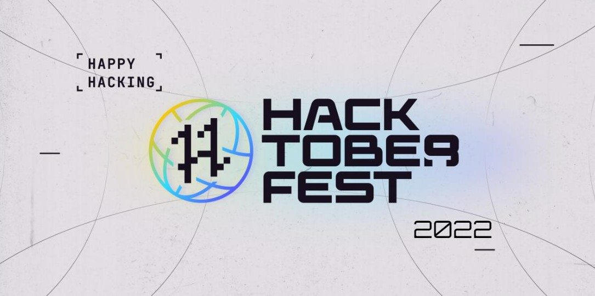

# Intellimixio 
<h2 align="center">👋 Hello Folks,</h2>

  
  

---

Welcome to the open source repository of Intellimixio PCE Purnea **[website](https://www.intellimixio.in/)** - Hackoberfest 2022 🚀

## Introduction
---
Intellimixio is the official club of Purnea college of engineering which is responsible for different kinds of activities cum coding, technical fests, sports, cultural events, drama etc on the campus. Checkout our **[blogs](https://blog.intellimixio.in/)**.

## Connect and Follow me elsewhere 🌎
---

## Contribute
---
Contributions are always welcome! See also the list of **[contributors](https://github.com/Intellimixiopce/intellimixio/graphs/contributors)** who participated in this project.

---
<h3 align="center">Show some &nbsp;❤️&nbsp; by starring some of the repositories!</h3>